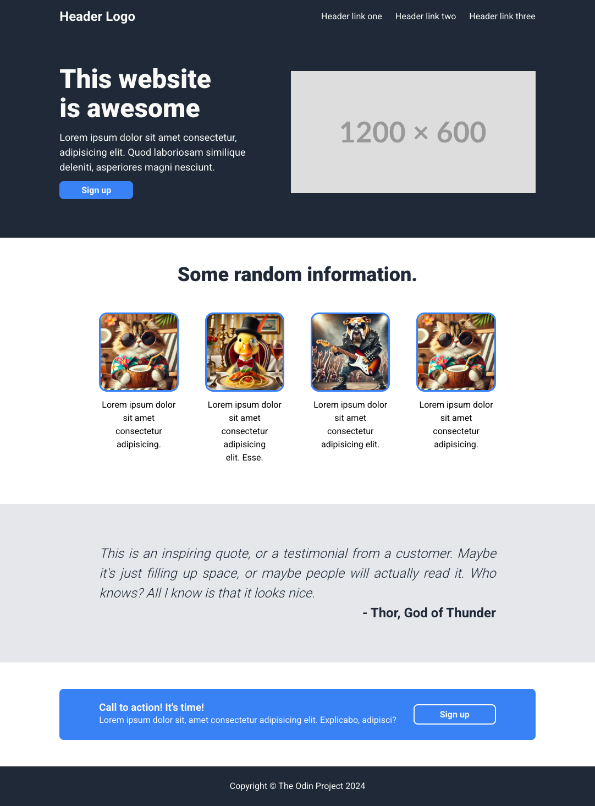

# Project Landing Page

A responsive landing page built with HTML and CSS. Features a hero section, cards, testimonial, and call-to-action.

**[View the page](https://jolbe.github.io/odin-project-landing-page/)**

## Features

- Responsive flexbox layout
- Hero section with hero image
- Card components with images
- Testimonial section
- Call-to-action button
- CSS custom properties for theming

## Screenshot

## Getting Started

### Prerequisites

- A modern web browser

### Usage

Open `index.html` in your browser or use a local server like Live Server.

## File Structure

- `index.html` — Main HTML document
- `styles.css` — Layout and styling
- `reset.css` — CSS reset for browser consistency
- `imgs/` — Image assets
- `dom/` — Directory for future JavaScript

## About

This is an exercise from [The Odin Project](https://www.theodinproject.com/).

---

**Note:** This README.md was AI-generated. All other project code was written manually.
